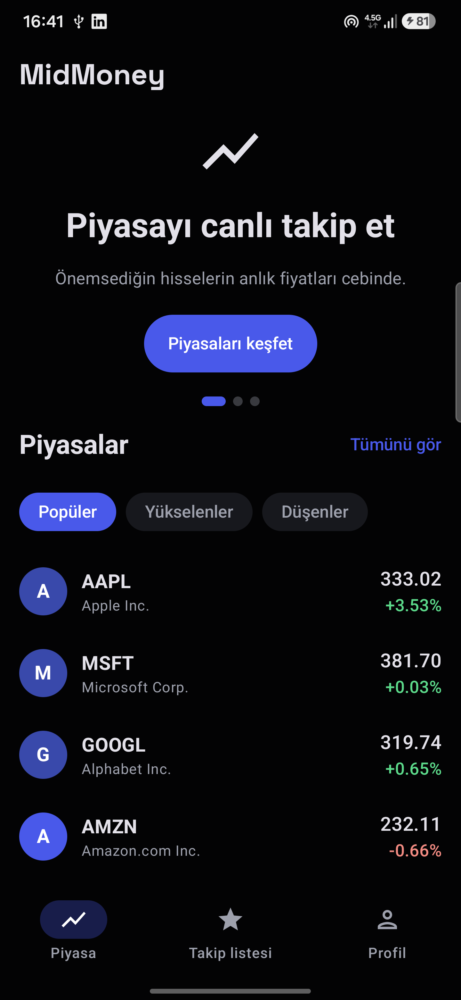
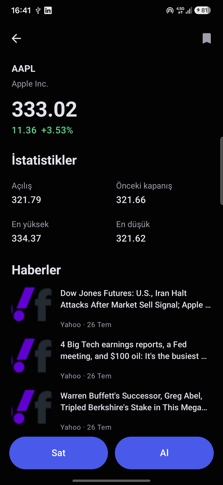
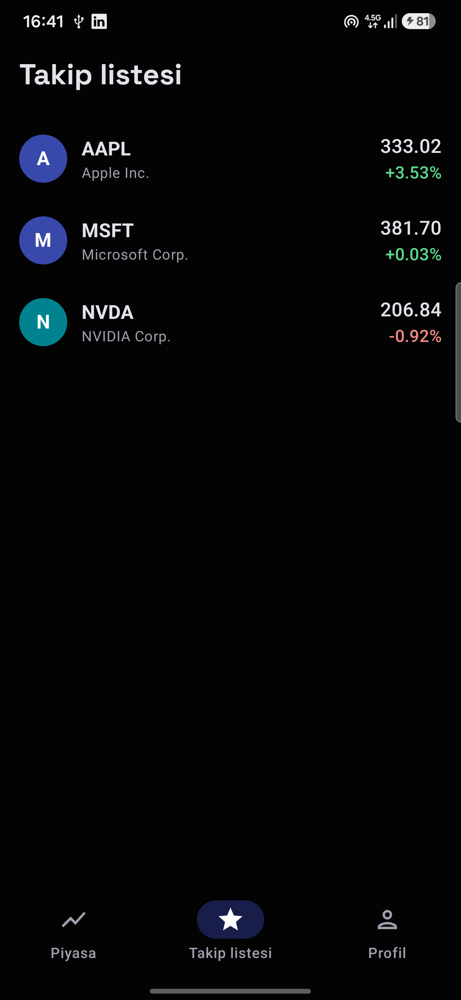
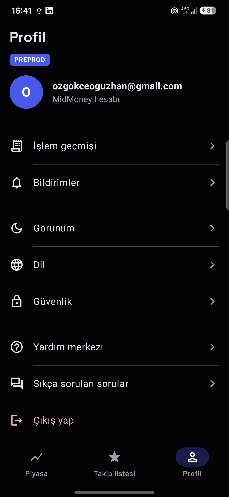

# MidMoney

[](https://github.com/oguzhanozgokce/MidMoney/actions/workflows/ci.yml)

A native Android market-tracking app built on the [Finnhub](https://finnhub.io) API: a curated stock
list with filters, symbol search, a detail screen with live WebSocket pricing and company news, and a
locally persisted watchlist.

**The app is intentionally small — the architecture is the point.** 22 Gradle modules across
`feature → plugin → library`, wired by convention plugins, with a single quality gate over all of it.

Kotlin · Jetpack Compose · Navigation 3 · Hilt · Coroutines & Flow · Retrofit · OkHttp WebSocket ·
DataStore · Firebase (Auth / Analytics / Remote Config) · Coil

| Market | Detail | Watchlist | Profile |
|---|---|---|---|
|  |  |  |  |

The UI is localized in English and Turkish and follows the system locale; the screenshots above are
in Turkish. Dark theme only, by design.

---

## Try it

### Option 1 — install the APK (nothing else needed)

Grab the latest build from the [Releases](../../releases) page. The API key is compiled into the
build, so there is **no configuration to do** — install and open.

No test account is needed either. The login screen signs in or registers automatically, so any email
plus a password of at least 6 characters works:

```
email:    tester@example.com
password: 123456
```

> The APK is debug-signed, so Play Protect may warn about an "unknown app" — choose *Install anyway*.
> Uninstall any earlier MidMoney build first: all variants share one application id, so they replace
> each other rather than installing side by side.

### Option 2 — build it yourself

See [Build from source](#build-from-source) below. Beyond a Finnhub API key you will need to register
your machine's debug signing certificate with Firebase, otherwise login fails — the details are in
that section.

---

## Build from source

### Prerequisites

| | Version |
|---|---|
| JDK | 17 |
| Android Gradle Plugin | 9.2.1 — needs an Android Studio release that supports it |
| Kotlin | 2.4.10 |
| Android SDK | compileSdk 37, minSdk 26, targetSdk 36 |

### 1. Clone

```bash
git clone https://github.com/oguzhanozgokce/MidMoney.git
cd MidMoney
```

### 2. Add a Finnhub API key

Create a free key at [finnhub.io/register](https://finnhub.io/register), then add it to
`local.properties` (untracked, never committed):

```properties
finnhub.apiKey=YOUR_KEY_HERE
```

CI reads the same value from a `FINNHUB_API_KEY` environment variable instead.

The key travels `local.properties → BuildConfig → ApiKeyInterceptor`, so it is never hardcoded in a
source file. Without a key the app builds and runs, but every request comes back unauthorised.

> Finnhub's free tier allows 60 calls/minute. `/quote` has no batch endpoint, so one screen of quotes
> is one request per symbol — scrolling aggressively can hit the limit, which the app surfaces as a
> retryable error.

### 3. Register your debug signing certificate

**This step is required, or login will fail.** The Firebase API key is restricted to registered
signing certificates, and every machine generates its own debug keystore — so a build made on your
machine is rejected until its fingerprint is known. The failure looks like a generic network error,
not an auth error, which makes it easy to misdiagnose.

Print your fingerprint:

```bash
keytool -list -v -keystore ~/.android/debug.keystore \
  -alias androiddebugkey -storepass android -keypass android
```

Send the `SHA1` line to the repository owner to have it added to the Firebase project — or skip this
by installing the released APK instead, which is already signed with a registered certificate.

### 4. Run

```bash
./gradlew :app:installProdDebug
```

`app/google-services.json` is committed, so there is no Firebase project setup to do.

### What you need, in short

| | Needed? |
|---|---|
| Finnhub API key in `local.properties` | **yes** |
| Debug SHA-1 registered in Firebase | **yes** (or install the APK instead) |
| `sdk.dir` in `local.properties` | written automatically when Android Studio opens the project |
| `google-services.json` | already in the repo |
| Firebase project / account | no |
| Test account | no — login auto-registers |

---

## Architecture

```
app/          DI wiring, Navigation 3 host, MainActivity, flavors
feature/      one screen area each: UI + ViewModel only
plugin/       a business domain each: domain + data + a client facade
library/      pure infrastructure, domain-agnostic and reusable
build-logic/  convention plugins — the single source of build configuration
```

**Dependency direction is `feature → plugin → library`.** Never `feature → feature`, never
`library → plugin`. A feature talks to a plugin only through its client facade, never to a
repository directly.

| Layer | Modules |
|---|---|
| `feature` | login, market, marketlist, detail, watchlist, profile |
| `plugin` | market, news, user |
| `library` | common, designsystem, error, event, logger, mvi, navigation, network, remoteconfig, websocket, testing |

### Key decisions

- **MVI by delegation.** A ViewModel declares
  `MVI<UiState, UiAction, UiEffect> by mvi(UiState())` and gets state, actions and one-shot effects
  without inheriting from a base class — composition over inheritance.
- **State is a `StateFlow`, effects are a `Channel`.** State must replay its latest value to a new
  collector; a one-shot effect must not. Modelling a toast or a navigation command as state makes it
  fire twice after a configuration change.
- **Navigation is a command bus.** ViewModels call `Navigator.navigate(Destination.X)`; the
  Navigation 3 host collects those commands. No `NavController` leaks into a ViewModel, which keeps
  ViewModels unit-testable and features independent of one another.
- **Errors are classified once, in the data layer.** Repositories return `Result<T>` from
  `ErrorHandler.call { }`, which owns the dispatcher, rethrows `CancellationException` and maps
  failures to a typed `AppError` through `ErrorMapper` multibindings. ViewModels never inspect a
  `Throwable`; they turn an `AppError` into a `UiText`.
- **Every DTO field is nullable.** The wire is untrusted, so "missing" is always possible; the mapper
  normalizes and drops unusable entries. Formatting happens in mappers, never in a `@Composable`.
- **Analytics routes per call.** `analytics.track(event, EventSupplier.Firebase)` hits one backend,
  `EventSupplier.All` hits every registered one. Adding a backend is one `@Binds @IntoSet` — no
  caller changes.

---

## Quality

| | |
|---|---|
| **Unit tests** | 68 tests — every feature ViewModel, the error handler, analytics routing, repository and DTO contracts. JUnit + Truth + Turbine + `kotlinx-coroutines-test`, fakes throughout (no mocking framework). |
| **E2E** | 9 [Maestro](https://maestro.mobile.dev) flows under `.maestro/`, organized per feature, selecting views by stable test tags. |
| **Static analysis** | detekt with `warningsAsErrors` and **no baseline file** — a new finding fails the build instead of joining a suppression list. Plus ktlint for formatting. |
| **CI** | GitHub Actions on every push and PR: ktlint → detekt → unit tests → assemble, with the APK uploaded as an artifact. Bitrise builds signed QA and prod APKs behind the same gate. |
| **Compose health** | `./gradlew <task> -PcomposeMetrics=true --rerun-tasks` writes stability and skippability reports, so `@Stable`/`@Immutable` decisions are measured rather than guessed. |

```bash
./gradlew ktlintCheck detekt test        # the full local gate
./gradlew :app:assembleProdDebug         # build the APK
maestro test .maestro/                   # all E2E flows (needs a running device)
```

---

## Build variants

Two product flavors on the `environment` dimension, configured once in `Flavor.kt` and surfaced to
the app through an injected `AppConfig` — library modules never read `BuildConfig` directly.

| Flavor | App name | Environment badge |
|---|---|---|
| `preprod` | MidMoney Preprod | shown on the profile screen |
| `prod` | MidMoney | hidden |

```bash
./gradlew :app:assemblePreprodDebug   # QA build
./gradlew :app:assembleProdDebug      # production-config build
```

---

## Known limitations

Deliberate scope cuts, listed so they are not mistaken for oversights:

- **Live pricing is detail-screen only.** Finnhub's socket is trade-based and can emit many ticks per
  second; feeding that into a list would recompose it continuously for little user value. Wiring it
  into the lists would need `conflate`/`sample` plus visible-item-only subscriptions.
- **The browse list is curated** (28 symbols in `MarketSymbols`). `/quote` prices one symbol per
  request, so a dynamic universe could not be priced within the free tier. The list belongs in Remote
  Config — the wrapper for it already exists.
- **No WebSocket reconnect.** A dropped socket stays dropped until the screen is reopened; the REST
  quote remains on screen, so the UI degrades rather than breaks.
- **R8 is disabled** and release builds are unsigned — the app ships as a debug build, so no release
  keystore is committed.
- **No Compose UI tests.** Screen behaviour is covered end to end by Maestro instead.
